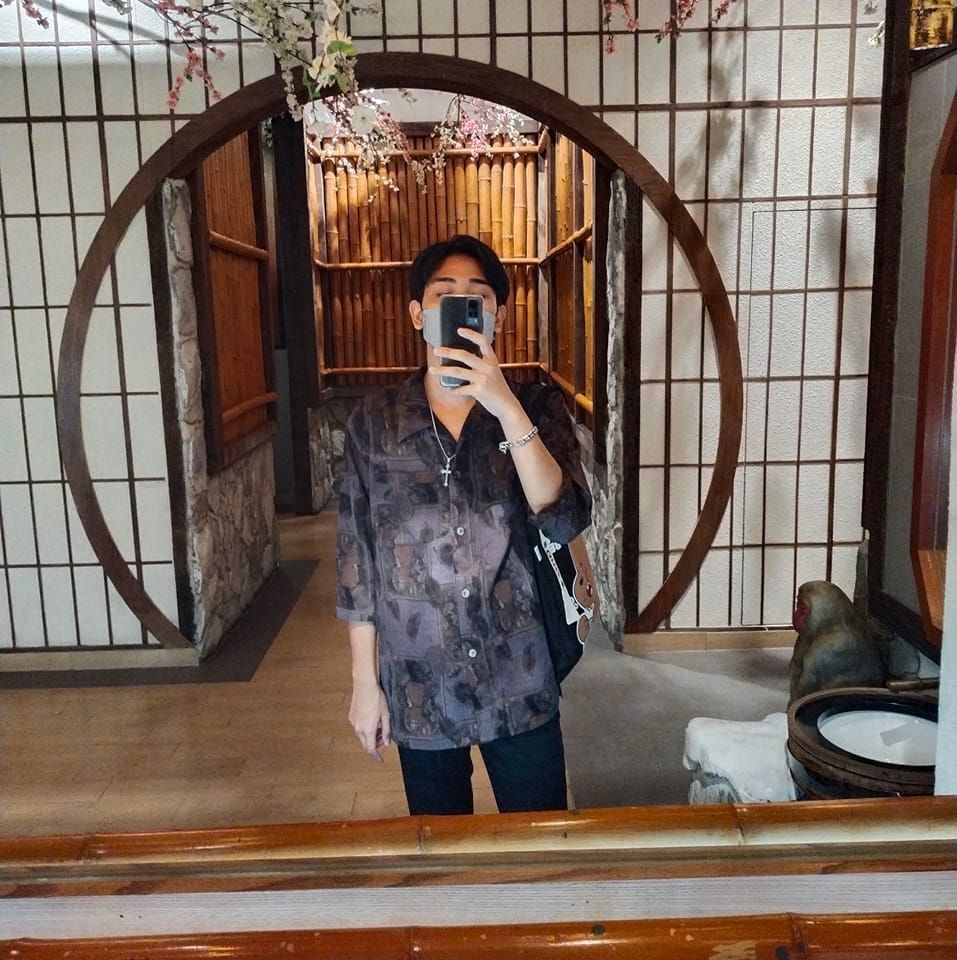

<!DOCTYPE html>
<html>

  <head>
    

<meta charset="UTF-8">
<link rel="icon" type="image/png" href="tool11_122838.png">
</head>
<body img src="https://i0.wp.com/windowscustomization.com/wp-content/uploads/2018/09/flat-earth.gif?fit=750%2C341&quality=80&strip=all&ssl=1" />
 
<h1 style="text-align: left;"><strong>&nbsp;นายสิรวิชญ์ เหรียญแพคงคา </strong></h1>
<h2 style="color:Tomato;text-align: left;"><strong>&nbsp;เกิดวันที่ 15 สิงหาคม ปี 2002 </strong></h2>
<h3 style="text-align: left;"><strong>&nbsp; - เชื้อชาติ ไทย</strong></h3>
<h3 style="text-align: left;"><strong>&nbsp; - สัญชาติ ไทย</strong></h3>
<h3 style="text-align: left;"><strong>&nbsp; - ศาสนา พุทธ</strong></h3>
<h2 style="color:Tomato;text-align: left;"><strong>&nbsp;ข้อมูลการศึกษา &#128513;</strong></h2>
<h3 style="text-align: left;"><strong>&nbsp; - มหาวิทยาลัยราชภัฏพระนคร สาขาอิเล็กทรอนิกส์คอมพิวเตอร์</strong></h3>
  
  
<h2 style="color:Tomato; text-align: left;"><strong>&nbsp; งานอดิเรก &#128516;</strong></h2>
<h3><em><strong>&nbsp; - ดูหนัง / ฟังเพลง / เล่นเกม / อ่านการ์ตูน</strong></em></h3>

 
  
     
  
  
 

  🌍  I'm based in Bangkok , Thailand  
  ✉️  You can contact me at  sirawit.15copter@gmail.com 
  🧠  I'm learning Phranakhon Rajabhat University 
  ⚡  ชอบที่จะได้ไปท่องเทียวที่ต่าง ชอบที่จะทำอาหารอ่างหนังสือยามว่าง  
   
  
 <h1 style="text-align: left;"><strong> Skills  </strong></h1>

 

  
 <h1 style="text-align: left;"><strong>  Socials </strong></h1>

   
  

 <h1 style="text-align: left;"><strong>My GitHub Stats</strong></h1>

 

  
  

  </body>
</html>
